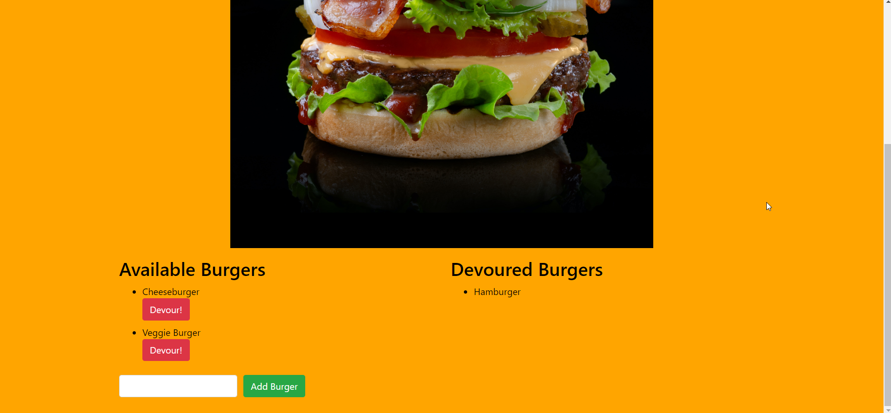

# Burger App

Deployed Application: https://hidden-coast-04312.herokuapp.com/

## Description

An interactive web page that allows users to submit burgers that they would like to devour. Data is stored in a MySQL database.

## Table of Contents

* [Installation](#installation)
* [Usage](#usage)
* [Credits](#credits)
* [License](#license)
* [Questions](#questions)

## Installation

To test the app's functionality in a local environment, first create the burgers_db database and its table using MySQL. A schema and seeds file can be found in the db directory. Then, create a `.env` file containing the host name, port number, username, password and database name.

Example:
```
DB_HOST=localhost
DB_PORT=3306
DB_USER=root
DB_PASS=password
DB_DATABASE=burgers_db
```

Run "npm start" to access the web page from localhost:8080.

## Usage

Submit burgers to devour. Devour them by clicking the "Devour!" button. Remove devoured burgers by clicking on the burger you wish to remove.



## Credits

Built with the support of instructors and colleagues from the UW Coding Boot Camp!

## License

[](LICENSE)

## Questions


Email me at <billyhao12@gmail.com>
